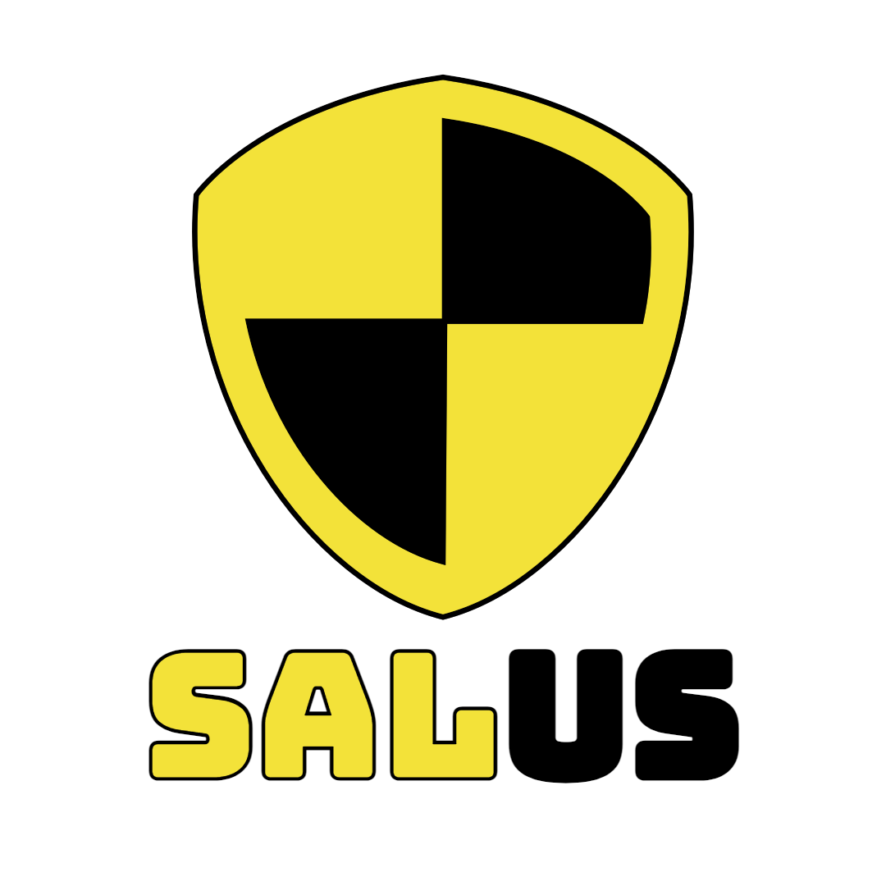

# Salus Security

Salus Security is an application that brings safety to citizens all over the world. This is done by people reporting incidents and bystanders helping the people in need.

Salus Security was originally a group project we had to work on during school. This was a java (server), Vue.js (client), H2 (database) project, but in my spare time I made a beta version of that project.

## Installation

To install and run the app on your local machine, please follow these steps:

- Clone this repository.
- Install dependencies using ``npm install``.
- add a folder in the root named config with a ``config.env`` file.
  - ``config.env`` will hold these values:
    - PORT=(your favourite port)
    - MONGO_URI=(your mongodb uri)
    - SALT_NUM=(a number between 10-12 to salt your encryption)
    - SESSION_SECRET=(your secret session key)
- Start the server using ``npm run start`` for production **OR** ``npm run dev`` for development.

## Usage

Once the app is running, you can register or log in using the provided forms. After logging in, you will be taken to the homepage where you can view all current incidents.

You can report incidents or help people in need by heading over to their incident.

You can also head over to the statistics page to see all the most frequently occurred incident labels or see who is the best bystander.

## Demo

Please check out the following [YouTube video](https://www.youtube.com/watch?v=lTB0XfUWERQ) to see most of the features of the app in action.

## Technologies Used

- Node.js
- MongoDB
- Express
- Express Handlebars
- HTML/CSS/JS
